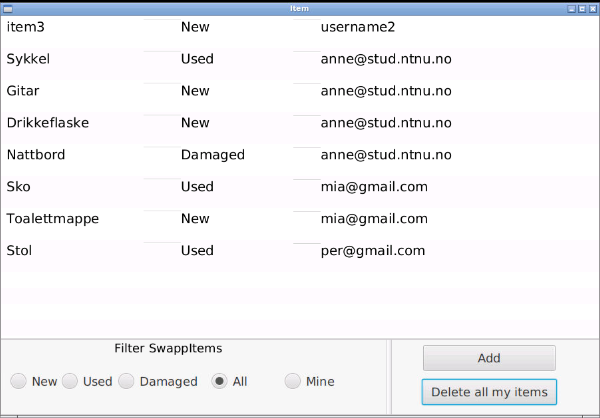
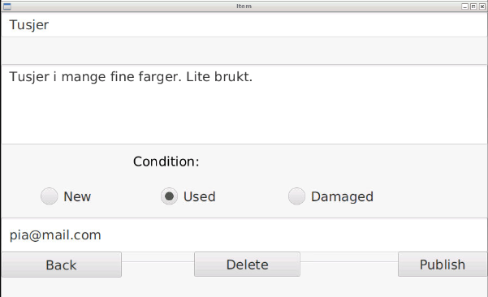
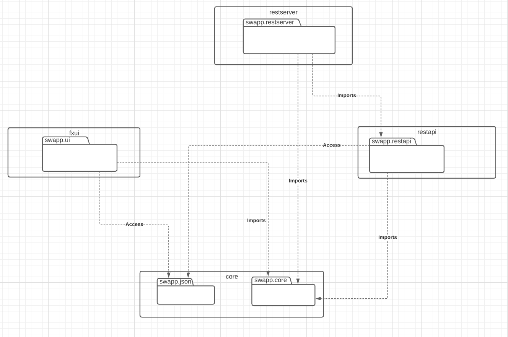

[](https://gitpod.idi.ntnu.no/#https://gitlab.stud.idi.ntnu.no/it1901/groups-2020/gr2065/gr2065) 

# SwApp
 
SwApp er en applikasjon der man kan gi bort ting man ikke trenger. Dette gjøres ved at man oppretter en annonse. Deretter kan andre brukere trykke på annonsen for å se detaljer om annonsen og ta kontakt på e-post-adresse som er oppgitt i annonsen. 



Når man først åpner appen kommer man til en innloggingsside hvor man skriver inn e-post-adresse. Denne er unik for hver bruker og brukes til å identifisere eiere av annonser. E-post-adressen blir også vist som kontaktinformasjon på annonsene man oppretter.

Hovedsiden (se bilde) viser en oversikt over alle annonser som ligger ute. Man kan også velge å filtrere annonsene på denne siden ved å bruke radio-knappene som ligger nede til venstre. Nede til høyre ser man kanpper for å legge til en ny annonse og for å slette alle annonser man selv har lagt ut.

Når man trykker på en annonse kommer man til et nytt vindu. Her ser man mer detaljer om annonsen. Dersom man selv eier annonsen har man også mulighet til å endre på den ved å gjøre endringer og trykke 'publish' eller å slette den ved å trykke 'delete'. Man kan ikke endre navnet på en annonse.

Når man oppretter en ny annonse kommer man også til et nytt vindu. Dette vinduet er likt som vinduet for å endre en annonse, unntatt at man ikke har en slette-knapp.



Bildet viser vinduet man ser når man har gått innpå en annonse man eier selv.

## Kjøring av koden
### Setup
Før du kan kjøre eller teste koden må du skrive følgende kommando i terminalen:
```
mvn install
```
Man kan velge å kjøre en lokal eller en remote versjon av applikasjonen.
Når man kjører den remote versjonen må man også kjøre restAPI og rest server som applikasjonen kommuniserer med. På gitpod kjører applikasjonen på port 6080.

### Kjør localaccess
```
mvn -pl fxui javafx:run
```

### Kjør remote
```
mvn -pl integrationtests jetty:run -D"jetty.port=8999"
```

```
mvn -Premoteapp -pl fxui javafx:run
```
(begge må kjøre samtidig)

## Testing av koden
Koden testes ved å kjøre følgende kommando i terminalen:
```
mvn clean test
```
Kommandoen vil gi en rapport i terminalen som indikerer hvorvidt testene var suksessfulle. 

For å få rapport om testdekningsgrad, kjør følgende kommando i terminalen:
```
mvn clean verify
```
Kommandoen gjør at det genereres en fil som viser testdekningsgrad. Testdekningsgrad-filen ligger i *target/site/jacoco* og heter *index.html*.

## Organisering av koden 

Koden til prosjektet ligger i **swapp**-mappen. Herunder er koden organisert slik:
- **/core** for koden og testkoden til kjernelogikken i applikasjonen
- **/fxui** for koden og testkoden til brukergrensesnittet til applikasjonen
- **/restserver** for koden og testkoden til restserveren
- **/restapi** for koden til restapiet
- **/integrationstest** for oppsettet for å kjøre restserveren og integrasjonstest
 
 

### Kjernelogikken
Applikasjonen samler annonse-data i et hashmap. Nøkklene i hash-map'et er e-post-adressene til brukerene. Verdien som tilhører hver nøkkel i hash-mappet er en liste med annonser. Hver annonse inneholder tittel, beskrivelse, tilstand og e-post-adresse.

### Brukergrensesnittet
Brukergrensesnittet i appen tar utgangspunkt i flere fxml-filer lokalisert i **fxui/src/main/resources/swapp/ui** og java-filer med javafx lokalisert i **fxui/src/main/java/swapp/ui**. Remote- og lokal-versjonen av applikasjonen er basert på et felles interface *SwappDataAccess* som gir lik funksjonalitet for begge variantene applikasjonen.


### Restserver og API
API'et er satt opp til å håndtere GET, PUT, POST og DELETE-forespørsler. Se en fullstendig oversikt over de mulige forespørslene i **restapi/readme.md**.

Serveren er satt opp til å lagre til og lese fra en json-fil på hjemmeområdet. Hver gang API'et mottar en GET-, PUT- eller POST-request oppdateres filen med den nåverende dataen. Til lagring og lesing benyttes serializers og deserializers som ligger i **/core/src/main/javas/swapp/json**. Hele hash-map'et er lagret i filen og når filen leses inn ved serverstart opprettes hash-mapet slik at API'et har tilgang til den samme dataen som da serveren ble avsluttet sist.

### Bygging med maven 
Prosjektet er konfigurert til å bruke byggeverktøyet maven, og har dermed en pom.xml-fil for konfigurasjon.


