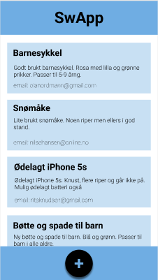

[](https://gitpod.idi.ntnu.no/#https://gitlab.stud.idi.ntnu.no/it1901/groups-2020/gr2065/gr2065) 

# Swap app 
 
Swap er en app der man kan gi bort ting man ikke trenger. Dette gjøres ved at man oppretter en annonse. Deretter kan andre brukere trykke på annonsen og ta kontakt. 




Skjermbildene over viser hvordan appen ser ut. Til venstre ser man 
flere annonser ligge under hverandre i en "feed". Dersom man trykker 
på plussknappen nederst i midten, vil man få opp vinduet til høyre. 
Der kan man legge til ny annonse med tittel, beskrivelse og epost. 
Deretter trykker man på V'en nederst i midten for å opprette annonse. 

## Kjøring av koden

Kjøring av koden gjøres ved å skrive følgende kommando i terminalen:
```
mvn clean favfx:run
```
På gitpod kjører applikasjonen på port 6080.

## Testing av koden
Koden testes ved å kjøre følgende kommando i terminalen:
```
mvn clean verify
```
Nå vil du få en rapport i terminalen som indikerer hvorvidt testene var suksessfulle. Nå er det også blitt laget en fil som viser testdekningsgrad. Testdekningsgrad-filen ligger i *target/coverage-reports* og heter *index.html*.

## Organisaering av koden 
 
- **src/main/java/swapp** for koden til applikasjonen
- **src/test/java/swapp** for testkoden 
 
## Domenelaget 
Appen samler annonse-data i form av tekst. 

Domenelaget finnes i **src/main/java/swapp/core**
 
## Brukergrensesnittlaget 
Brukergrensesnittet i appen viser liste med annonser, samt en knapp for å legge til ny annonse. 

Brukergrensesnittet er laget med JavaFX og FXML og finnes i **src/main/java/swapp/ui**

## Persistenslaget 
Persistenslaget inneholder alle klasser og logikk for lagring av annonse-data i domenelaget. Vårt persistenslag implementerer fillagring med JSON-syntaks, og finnes i **src/main/java/swapp/json**

## Bygging med maven 
Prosjektet er konfigurert til å bruke byggeverktøyet maven, og har dermed en pom.xml-fil for konfigurasjon. 
