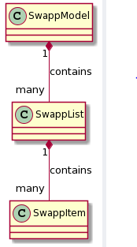

# Core

Core inneholder kjernelogikken til applikasjonen og er delt i mappene core og json. Her ligger også testene for denne koden.

## Core

Core-mappen inneholder klassene som utgjør kjernelogikken til applikasjonen.

*SwappItem* er klassen som representerer en annonse. Klassen har attrubuttene *name*, *status*, *description* og *username* som alle er strings. Funksjonene til klassen er for å sette og hente de ulike attributtene, samt noen funksjoner for å sjekke om attributtene er lik en inputt-attributt. 

*SwappList* er en klasse som representerer en liste med annonser. Klassen har attributtene *username*, *swappItems* og *swappListListeners*. Funksjonene til klassen er å hente atributter, legge til og fjerne annonser i *swappItems*-listen, samt validere om en gitt annonse kan legges til eller fjernes fra listen.

*SwappListListener* er en klasse som kun benyttes i den lokale versjonen av applikasjonen og benyttes for å holde styr på når det foregår endringer på SwappList slik at ui'et vil oppdatere seg. 

*SwappModel* er den overodnede klassen i kjernelogikken og den holder styr på alle brukerne med tilhørende annonser. Klassen har et LinkedHashMap-attributt *swappLists* som har *username* som nøkkler og *SwappList* som verdier. Klassen har funksjoner for å hente, legge til og fjerne annonser, samt funksjoner for å validere annonser og brukernavn.

## Json

Json-mappen inneholder serializers og deserializers, samt hjelpeklasser for å benytte disse.

*SwappItemDeserializer*, *SwappListDeserializer* og *SwappModelDeserializer* er deserializers for hver sin klasse fra core. Deserializerne benyttes både av restserveren og den lokale versjonen av applikasjonen for å lese fra fil når de startes opp fra kommandolinjen.

*SwappItemSerializer*, *SwappListSerializer* og *SwappModelSerializer* er tilsvarende Serializers for hver sin klasse fra core. Serializerne benyttes både av restserveren og den lokale versjonen av applikasjonen for å skrive til fil under kjøring, slik at den nyeste versjonen av dataen er lagret når serveren/applikasjonen avsluttes. Det lagres til samme fil som det leses fra når serveren/applikasjonen starter opp igjen.

*SwappPersistence* og *SwappModule* er to klasser som gjør bruken av serializerne og deserializerne lettere. *SwappPersistence* benytter *SwappModule*-klassen og har en funksjon for å lese til fil og en annen funksjon for å skrive til fil. *SwappModule* er en klasse som inneholder alle serializerne og deserializerne.

## Tester

*SwappItem*, *SwappList* og *SwappModel* testes med oppretting, endring og sletting av objekter i hver av klassene. Valideringsmetodene i klassene testes også.

I *SwappModuleTest* og *SwappPersistenceTest* testes klassene ved å serializere og deserializere  *SwappItem*-, *SwappList*- og *SwappModel*-objekter.
