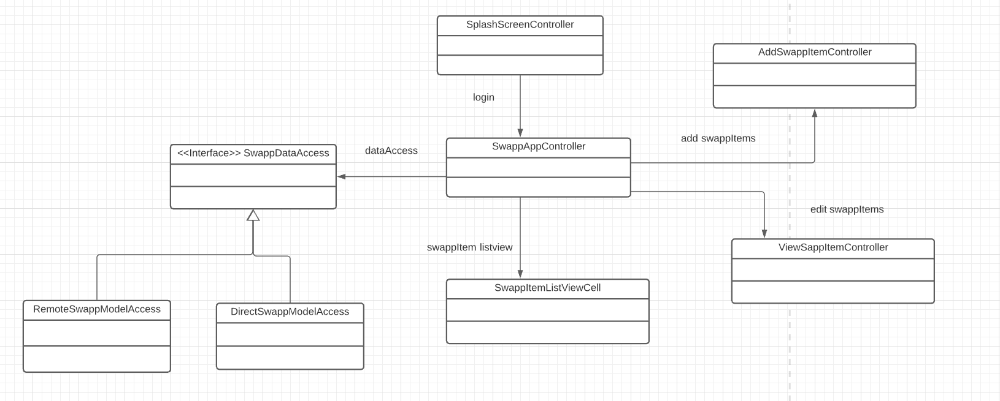

# Fxui

Fxui inneholder brukergrensesnittet til applikasjonen. Fxui-mappen er skilt i to undermapper: *ui* og *resources*

## ui

ui-mappen inneholder klassene som benyttes til logikken i brukergrensesnittet. Her er det noen klasser og interfaces som benyttes av både den lokale og den remote versjonen, mens noen klasser benyttes av kun den éne versjonen.

*SwappDataAccess* er et interface som brukes av begge versjonene av applikasjonen. Interfacet spesifiserer funksjoner som skal benyttes for å håndtere endring, sletting og opprettelse av annonser og brukere. 

Klassene *App* og *RemoteSwappAccess* benyttes av den remote versjonen av applikasjonen. *App* extender Application og har start-funksjonen som setter vinduet til innloggings-vinduet. *DirectSwappAccess* er klassen som implementerer *SwappDataAccess*-interfacet i den lokale versjonen av applikasjonen. Denne klassen håndterer også lesing fra og skriving til fil.

Tilsvarende benyttes klassene *RemoteApp* og *RemoteSwappAccess* av den remote versjonen av applikasjonen. *RemoteApp* extender Application og har start-funksjonen som setter vinduet til innloggings-vinduet. *DirectSwappAccess* implementerer *SwappDataAccess*-interfacet i den remote versjonen av applikasjonen. Denne klassen har funksjoner for å hente og sende data til API'et. 

Det er egne kontrollere for hver av de ulike vinduene i brukergrensesnittet. Disse er navngitt for å spesifisere hvilket vindu de kontrollerer: 

* *AddSwappItemController* kontrollerer vinduet for å opprette en ny annonse. 
* *SwappAppController* kontrollerer hoved-vinduet som inneholder listen for å se annonser, radio-knapper for filtrering og knapper for å slette og legge til nye annonser. 
* *SwappItemListViewCell*-klassen er opprettet for å spesifisere hvordan en enkelt annonse ser ut i listen. 
* *SwappSplashScreenController* er kontrolleren for innloggings-vinduet. 
* *ViewSwappItemController* er kontrolleren for vinduet der man ser mer informasjon om en enkelt annonse.

## resources

resources-mappen inneholder fxml-filene som utgjør det brukergrensesnittet brukeren ser når applikasjonen kjøres. Her er de fleste filene felles for begge versjonene av applikasjonen. fxml-filene er navngitt etter kontrollerne de tilhører. Vi benyttet Scenebuilder til å designe brukergrensesnittet og lage fxml-filene. De to versjonene av applikasjonen har ulike SplashScreen-filer for innlogging, da filnavnet (lokal) og URI'en (remote) settes eksplisitt i disse filene.

## Testing

Både den lokale og den reomte versjonen av applikasjonen testes. På den lokale testen testes funksjonaliteten, mens i testingen av den remote versjonen opprettes et mock-objekt og det testes at oppsettet fungerer. Vi mener det er tilstrekkelig å teste funksjonaliteten på kun den lokale versjonen, da kontrollerene til begge versjonene av applikasjonen er basert på samme interface og de benytter de samme fxui-filene.

